<p align="center">

  <h1 align="center">Linux Practical Examination</h1>

  <p align="center">
    Hands-on Linux Administration & System Management
  </p>

  <p align="center">
    
    
    
    
  </p>

</p>

---

## About the Project

This project demonstrates practical Linux administration and command-line operations performed as part of a Linux Practical Examination.

The practical covers essential Linux administration concepts including:

- File and directory management
- User and group management
- File permissions and ownership
- Package management
- Apache web server administration
- Process management
- Searching and text processing
- Networking
- Linux service management
- Basic troubleshooting

All practical activities were performed using Linux command-line tools.

---

## Linux Environment

| Configuration | Details |
|---|---|
| Operating System | Linux |
| Shell | Bash |
| Web Server | Apache HTTP Server |
| Platform | AWS EC2 |
| Screenshot Directory | `image/` |

---

# Architecture

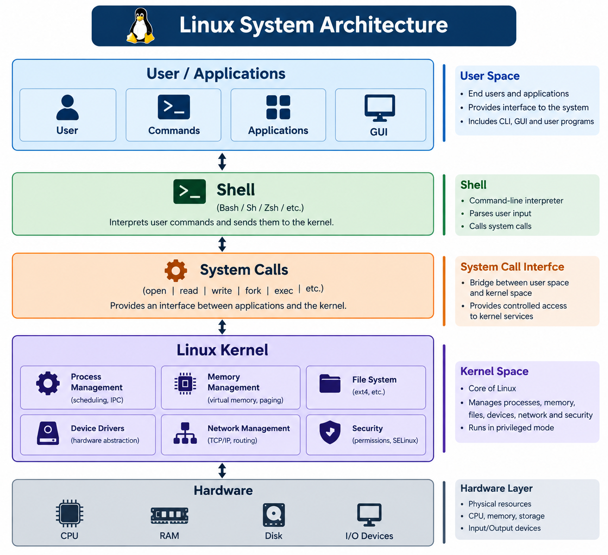

# Step 1 — Launch AWS EC2 Instance

### Task

- Login to AWS Management Console
- Launch an EC2 instance
- Select the required Linux operating system
- Configure the instance settings
- Configure the Security Group
- Allow SSH access on port 22
- Launch the EC2 instance
- Connect to the instance using SSH

### Screenshot

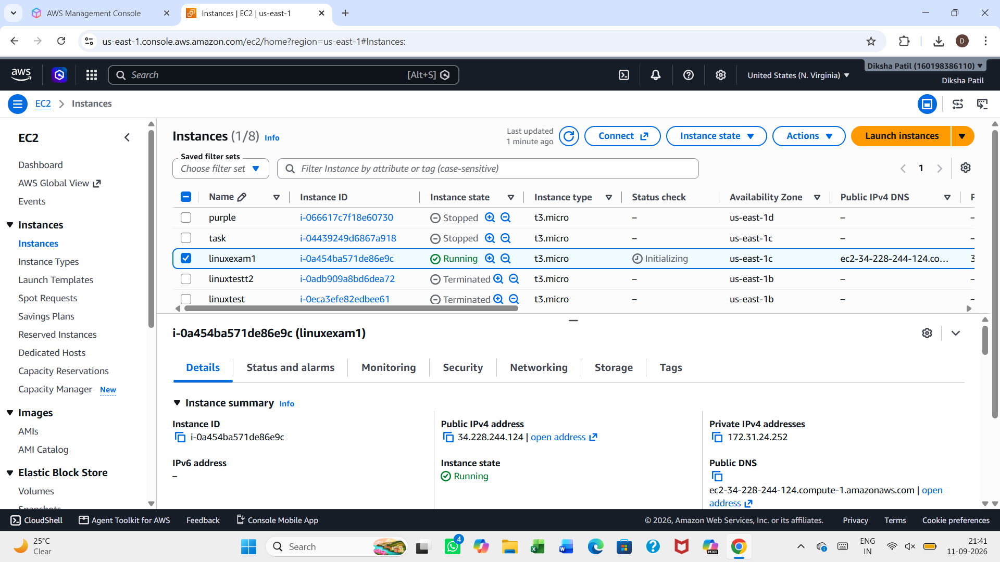

### Result

The AWS EC2 instance was launched successfully and configured for performing the Linux practical tasks.

---

# Section A — File & Directory Management

## Q1. Basic File Operations

### Task

- Create a directory named `LinuxExam`
- Navigate into the directory
- Create `student.txt`
- Create `course.txt`
- Create `result.txt`
- Display the current working directory
- Display the contents of the directory

### Commands Used

```bash
mkdir LinuxExam
cd LinuxExam
touch student.txt course.txt result.txt
pwd
ls
```

### Screenshot
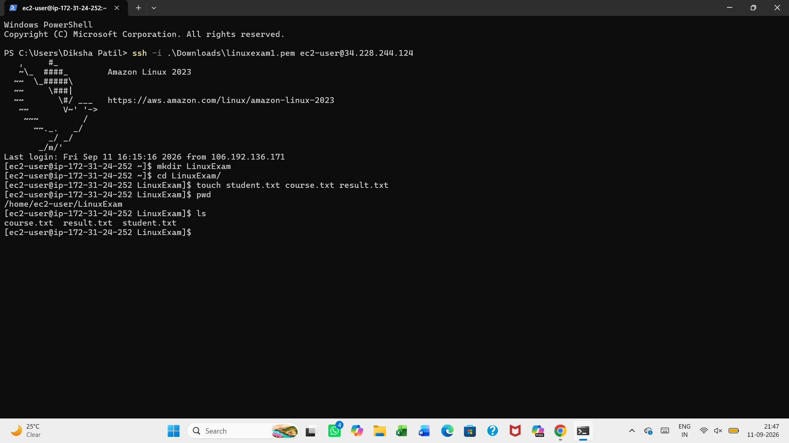

### Result

The `LinuxExam` directory and required files were created successfully. The current working directory and directory contents were displayed.

---

## Q2. File Management

### Task

Inside `LinuxExam`:

- Copy `student.txt` as `student_backup.txt`
- Rename `course.txt` to `linux_course.txt`
- Delete `result.txt`
- Create `Documents`, `Backups`, and `Scripts`
- Move `student_backup.txt` into `Backups`
- Display the directory structure

### Commands Used

```bash
cp student.txt student_backup.txt
mv course.txt linux_course.txt
rm result.txt
mkdir Documents Backups Scripts
ls
mv student_backup.txt Backups/
tree
```

### Screenshot

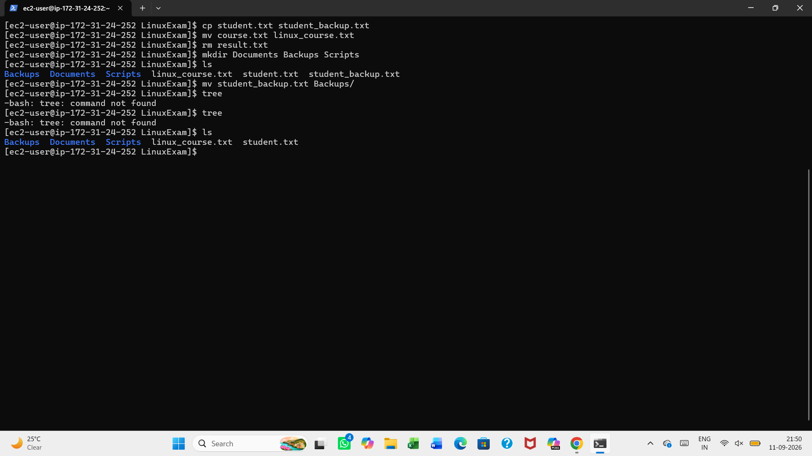

### Result

The required file and directory operations were completed successfully.

---

## Q3. File Content Operations

### Task

- Add at least 5 lines of student information to `student.txt`
- Add at least 5 lines of course information to `linux_course.txt`
- Display contents using `cat`
- Display first 3 lines using `head`
- Display last 2 lines using `tail`
- Count lines, words, and characters in `student.txt`

### Commands Used

```bash
cat > student.txt
cat > linux_course.txt
cat student.txt
cat linux_course.txt
head -n 3 student.txt
tail -n 2 student.txt
wc -l student.txt
wc -w student.txt
wc -c student.txt
```

### Screenshot

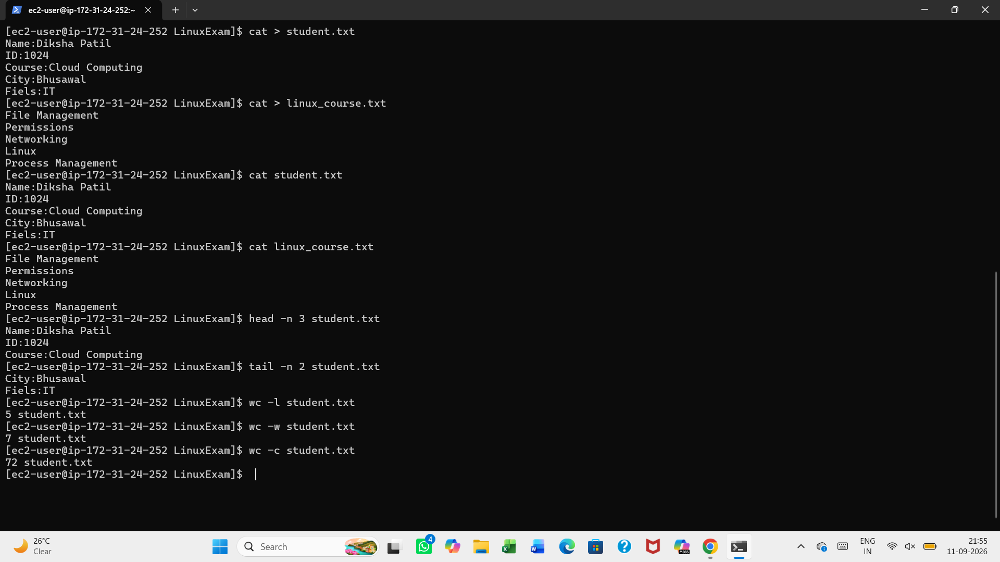

### Result

The required information was added and verified using `cat`, `head`, `tail`, and `wc`.

---

# Section B — Users, Groups & Permissions

## Q4. User Management

### Task

- Create a user named `student01`
- Set a password
- Verify that the user exists
- Display UID and GID
- Display the user's home directory
- Switch to `student01`
- Verify the current username

### Commands Used

```bash
sudo -i
sudo useradd student01
sudo passwd student01
cat /etc/passwd | grep "student01"
su - student01
whoami
```

### Screenshot

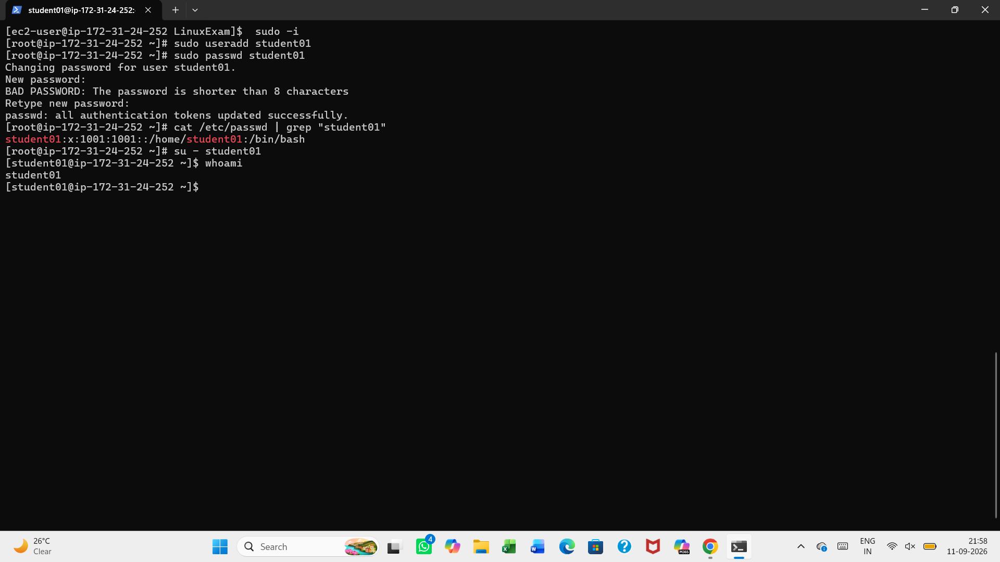

### Result

The `student01` user was created, configured, and successfully verified.

---

## Q5. Group Management

### Task

- Create a group named `linuxbatch`
- Add `student01` to `linuxbatch`
- Verify the groups of `student01`
- Create another user named `student02`
- Add `student02` to `linuxbatch`
- Display all members of the group

### Commands Used

```bash
sudo -i
groupadd linuxbatch
cat /etc/group | grep "linuxbatch"
gpasswd -a student01 linuxbatch
groups student01
useradd student02
cat /etc/passwd | grep "student02"
gpasswd -a student02 linuxbatch
getent group linuxbatch
```

### Screenshot

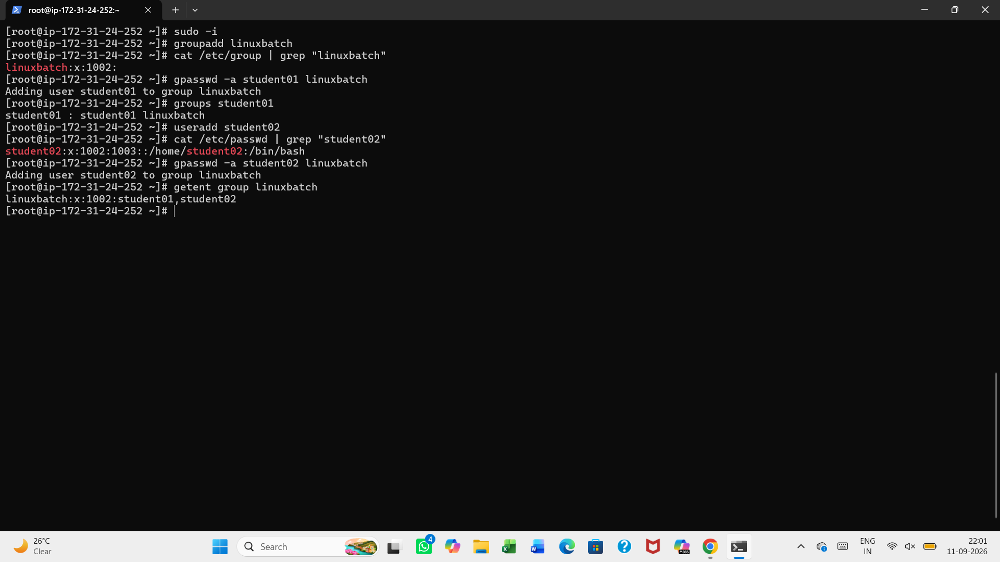

### Result

The `linuxbatch` group was created and both users were added successfully.

---

## Q6. File Permissions

### Task

Create `project.txt` and configure:

- Owner: Read, Write and Execute
- Group: Read and Execute
- Others: Read only
- Expected permission: `754`
- Change permission to `640`
- Change owner to `student01`
- Change group ownership to `linuxbatch`
- Verify final permissions and ownership

### Commands Used

```bash
touch project.txt
chmod 754 project.txt
ls -l project.txt
chmod 640 project.txt
sudo chown student01 project.txt
ls -l project.txt
sudo chgrp linuxbatch project.txt
ls -l project.txt
```

### Screenshot

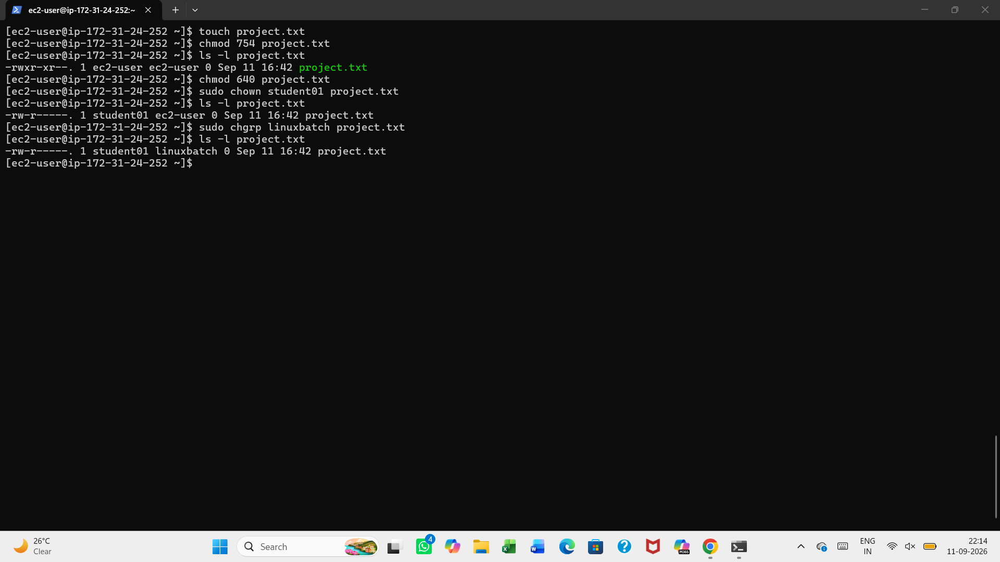

### Result

The required file permissions and ownership were configured and verified successfully.

---

## Q7. Permission Challenge

### Task

Create:

```text
LinuxExam/
├── public/
├── private/
└── shared/
```

Configure permissions so that:

- `public` can be accessed by everyone
- `private` can be accessed only by its owner
- `shared` can be accessed by the owner and group members
- Verify permissions using `ls -ld`

### Commands Used

```bash
mkdir public private shared
ls
chmod 755 public/
chmod 700 private/
chmod 770 shared/
ls-ld public private shared
```

### Screenshot

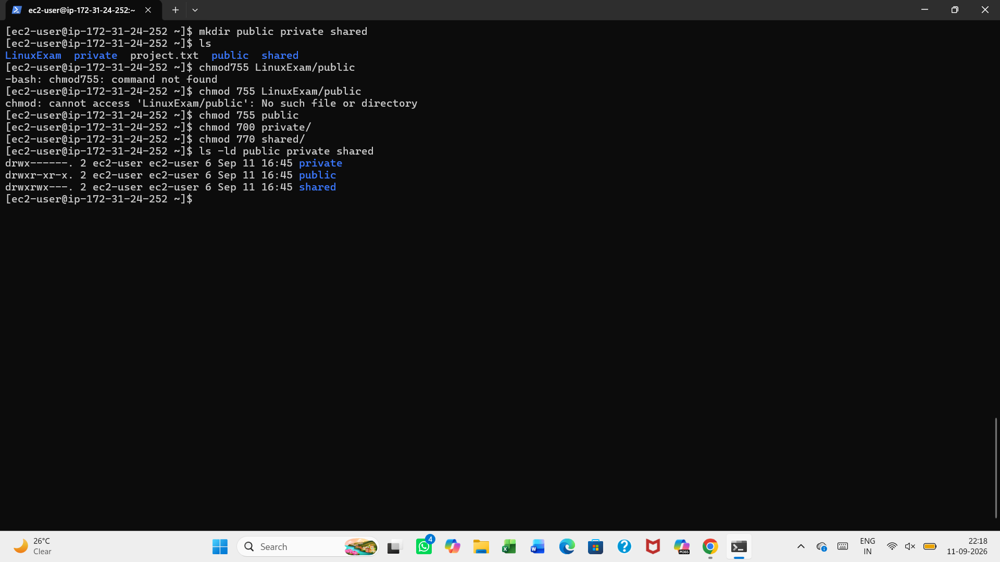

### Result

The required permissions were configured and verified using `ls -ld`.

---

# Section C — Package Management & Services

## Q8. Package Management

### Task

- Update the package repository
- Install Apache Web Server
- Verify Apache installation
- Display Apache version
- Start Apache
- Check Apache status
- Configure Apache to start automatically at boot

### Commands Used

```bash
sudo yum update -y
sudo yum install httpd -y
httpd -v
sudo service httpd start
sudo service httpd status
sudo systemctl enable httpd
```

### Screenshot

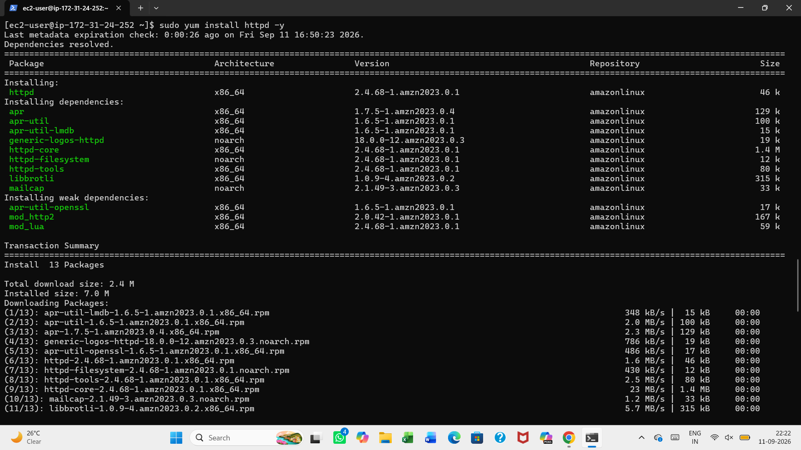

.png)

### Result

Apache was installed, started, verified, and configured to start automatically at boot.

---

# Section D — Apache Web Server Configuration

## Q9. Apache Web Server Configuration

### Task

- Find the Apache document root
- Create a custom `index.html`
- Add student name
- Add roll number
- Add course name
- Add "Linux Practical Examination"
- Restart Apache
- Access webpage using browser or curl
- Display HTTP response using curl

### Commands Used

```bash
grep -i "DocumentRoot" /etc/httpd/conf/httpd.conf
sudo nano /var/www/html/index.html
sudo service httpd restart
curl http://localhost
curl -I http://localhost
```

### Screenshot

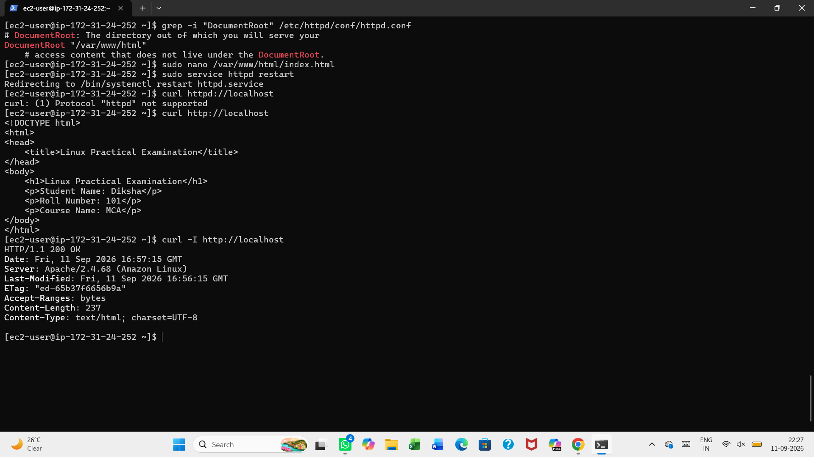

### Result

The custom Apache webpage was created and successfully accessed using the browser and `curl`.

---

# Section E — Processes & System Administration

## Q10. Process Management

### Task

- Display all running processes
- Display processes in real time using `top`
- Find the PID of Apache
- Display the process using its PID
- Stop Apache
- Verify Apache has stopped
- Start Apache again
- Verify its status

### Commands Used

```bash
ps aux
top
pgrep httpd
ps -p 28811 -f
sudo service httpd stop
sudo service httpd start
sudo service httpd status
ps -ef grep httpd
ps -p 29318 -f
sudo kill 29318
ps -p 29318
```

### Screenshot

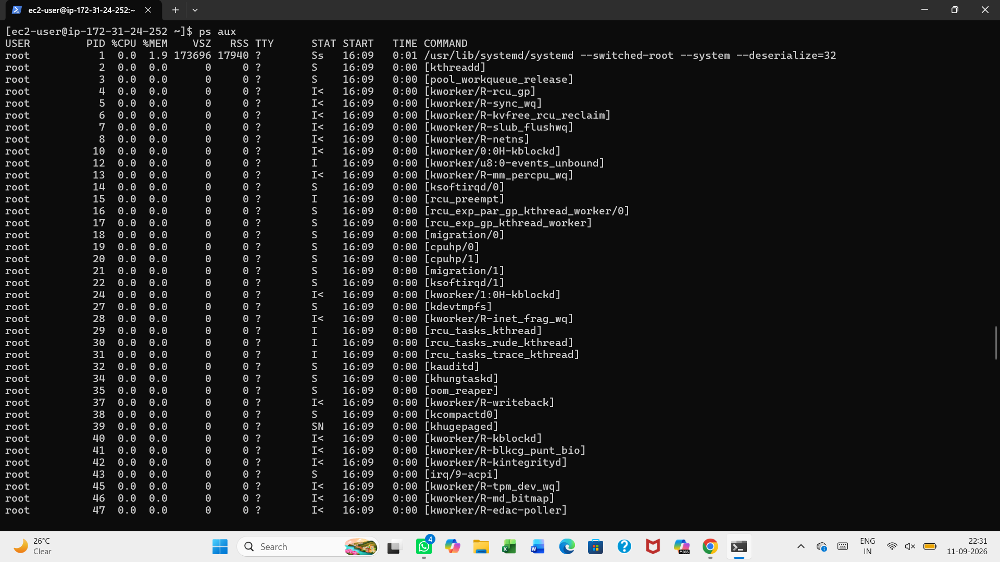

.png)

.png)

.png)
### Result

Apache processes were identified, monitored, stopped, started, and verified successfully.

---

# Section F — Searching, Filtering & Logs

## Q11. Search and Text Processing

### Task

Inside `LinuxExam`:

- Create `students.txt` containing at least 10 student records
- Use `grep` to find students matching a name or pattern
- Use case-insensitive searching
- Count matching records
- Sort student records
- Search for a particular file using `find`
- Find students whose name contains the letter `a`
- Find `.txt` files inside `LinuxExam`

### Commands Used

```bash
cd LinuxExam
nano students.txt
grep "diksha" students.txt
grep -i "diksha" students.txt
grep -ic "a" students.txt
sort students.txt
find . -name students.txt
find . -name "*.txt"
```

### Screenshot

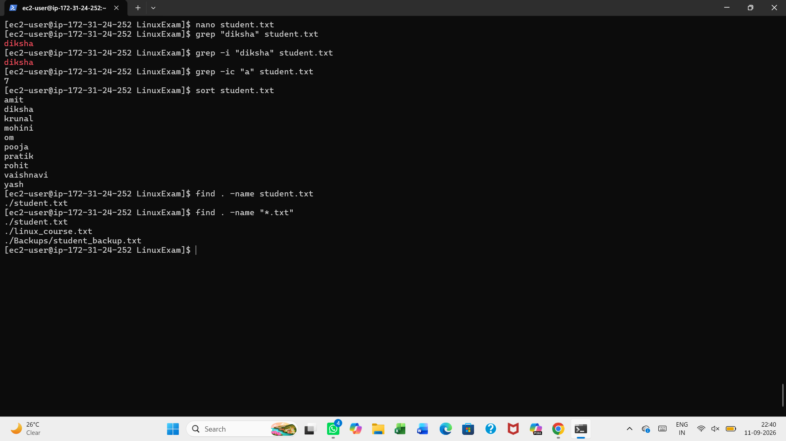

### Result

Student records were created and successfully searched, filtered, counted, sorted, and located using Linux commands.

---

# Section G — Networking

## Q12. Linux Networking

### Task

- Display system hostname
- Display IP address
- Display network interfaces
- Display routing table
- Test connectivity
- Use `ping`
- Use `curl`
- Find IP address of a domain
- Display listening ports

### Commands Used

Display hostname:

```bash
hostname
hostname -I
ip addr
ip route
ping google.com
curl https://www.google.com
nslookup google.com
sudo ss -tulpn
```

### Screenshot

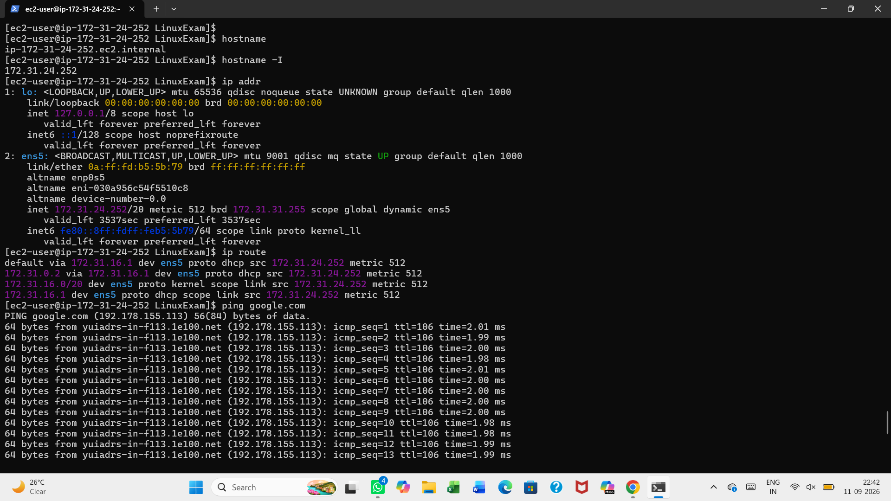

.png)

### Result

The hostname, IP address, network interfaces, routing table, connectivity, domain IP address, and listening ports were successfully checked.

---

# 🎓 Learning Outcomes

Through this practical examination, I gained hands-on experience with:

- Linux file and directory management
- Linux user management
- Linux group management
- File permissions and ownership
- Apache web server installation
- Apache configuration
- Linux process management
- Searching and text processing
- Linux networking
- Linux service management
- Basic troubleshooting

---

# 📝 Conclusion

This Linux Practical Examination provided hands-on experience with Linux system administration and command-line operations.

I learned how to manage files, users, groups, permissions, services, processes, Apache web server, text files, and network configurations.

This practical strengthened my understanding of Linux administration and improved my ability to perform and troubleshoot common Linux tasks using command-line tools.

---

# 👨‍💻 Author

**Diksha Patil**

**MCA Student | Aspiring DevOps Engineer**
